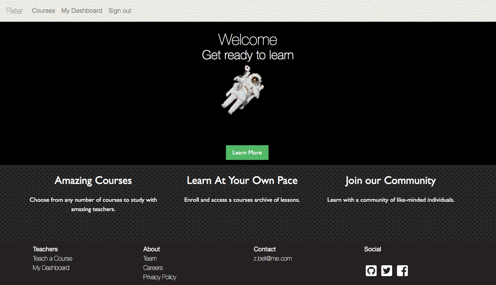

# Flixter

A video-streaming marketplace for educators to facilitate lessons, featuring payment capabilities(stripe), user role management, complex user interfaces, and advanced database relationships.

## Built With

* Ruby on Rails 5.2.3
* Ruby 2.5.3
* AWS S3 Storage

## Gems

* [Stripe](https://github.com/stripe/stripe-ruby) - Credit Card Payment Handler
* [Devise](https://github.com/heartcombo/devise) - User management and authentication
* [Carrierwave](https://github.com/carrierwaveuploader/carrierwave) and [MiniMagick](https://github.com/minimagick/minimagick) - Media uploading 

## Acknowledgments

* [The Firehose Project](https://thefirehoseproject.com)
